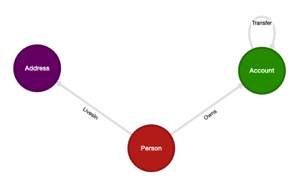
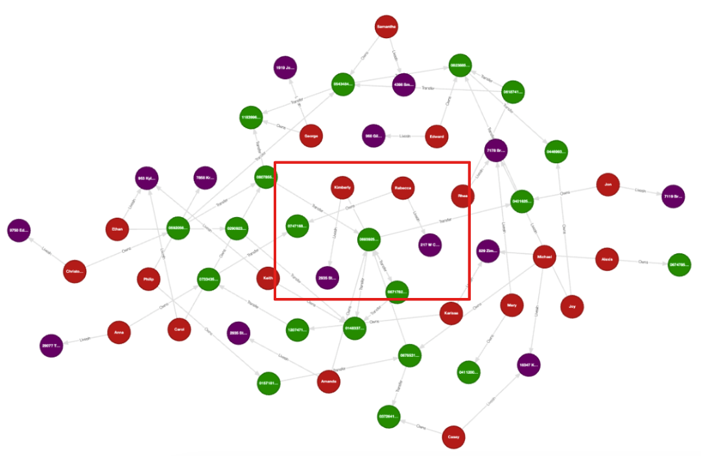

# Cypher Workshop: Analyze a financial network

This repo contains the problem statement and DDL code for a workshop on analyzing a financial network using
Cypher in [Kùzu](https://github.com/kuzudb/kuzu), an embedded property graph database. For comparison,
the same analysis is performed using SQL in [DuckDB](https://github.com/duckdb/duckdb), an embedded
relational database.

## Installation

## CLI

This section shows how to install the command-line interfaces (CLIs) for Kùzu and DuckDB.

### Kùzu CLI Nightly version
To install the nightly version, go [here](
https://github.com/kuzudb/kuzu/actions/workflows/build-and-deploy.yml), click on the top most "Build and Deploy" link. Under "Artifacts,
download the `kuzu_cli_xxx` file for your system. Then you need to uncompress the downloaded file and use the kuzu binary inside it.

### Kùzu CLI Stable version
To install the Kùzu CLI on MacOS, run:

```bash
brew install kuzu
```

For installing the Kùzu CLI on other operating systems, see the installation instructions on
[our website](https://kuzudb.com/#download)

### DuckDB CLI

To install the DuckDB CLI on MacOS, run:

```bash
brew install duckdb
```

For installing the DuckDB CLI on other operating systems, see the installation instructions in
[the docs](https://duckdb.org/docs/installation/).

## Python

Python code is provided to run the data ingestion and queries. To install the required packages
(including the `duckdb` and `kuzu` Python clients) via the `uv` package manager, run the following:

```bash
uv venv
source .venv/bin/activate
uv pip install -r requirements.txt
```

## Run DDL

This step covers how to create the schema and insert data into the databases.

### CLI

To run the DDL using the CLIs, simply copy-paste the commands from the files provided in the `ddl/`
directory. Note that in both the Kùzu and DuckDB CLIs, the `;` character is required to indicate the end
of a statement.

#### Kùzu

Enter the Kùzu CLI at the root level of this repo by running the below command:

```bash
kuzu ./ex_db_kuzu
```

In the CLI, simply copy-paste the contents of the [`ddl/insert_data_kuzu.cypher`](./ddl/insert_data_kuzu.cypher)
file into the Kùzu CLI shell editor and press `Enter`.

#### DuckDB

Enter the DuckDB CLI at the root level of this repo by running the below command:

```bash
duckdb ./ex_db.duckdb
```

In the CLI, simply copy-paste the contents of the [`ddl/insert_data_duckdb.sql`](./ddl/insert_data_duckdb.sql)
file into the DuckDB CLI shell editor and press `Enter`.

### Python scripts

An alternative to using the CLI for DDL is to run the following Python scripts that insert data into
DuckDB and Kùzu respectively:

```bash
python insert_data_duckdb.py
python insert_data_kuzu.py
```

This completes the DDL and you are now ready to query either database!

## Queries

The following queries are to be asked, for which we need to use Cypher in Kùzu and SQL in DuckDB:

- Q1: Find all direct transfers to the user with the account `georodaw366@hotmail.com`
- Q2: Find all possible connections of type Transfer, including indirect ones up to length k = 5, between the accounts owned by `georodaw366@hotmail.com` and - `ezimmerman@yahoo.com`. You can try k > 5 to also see how the number of paths increases rapidly.
- Q3: Find the shortest connections of type Transfer between the accounts owned by `georodaw366@hotmail.com` and `ezimmerman@yahoo.com`
- Q4: Find all connections of any type between the persons `georodaw366@hotmail.com` and `ezimmerman@yahoo.com`. We are searching for any possible shortest paths between these two persons, not just the transfers between accounts owned by them.
- Q5: Find 3 persons who have all transferred money to each other (in at least one direction).
- Q6: Find an important account that has the most incoming transactions

---

## Problem statement

Open the PDF document "Code for workshop demonstrating the use of Cypher on a financial network.pdf" provided here to see the problem statement.

## Visualization

You can visualize the Kùzu graph using the Kùzu Explorer tool. Download and install Docker, and run the
provided `docker-compose.yml` file to start Kùzu Explorer on your machine. Simply ensure that
the directory to the local database directory is correctly specified in `docker-compose.yml`.
Note: if you want to use the nightly version of Explorer, change the `image: kuzudb/explorer:latest` in the 
`docker-compose.yml` file with `image: kuzudb/explorer:dev`.

```bash
docker compose pull
docker compose up
```

Alternatively, you can run the following Docker command from the terminal, once again taking care to
ensure that the correct path to the local database directory is specified:

```bash
docker run -p 8000:8000 \
           -v ./ex_db_kuzu:/database \
           -e MODE=READ_ONLY \
           --rm kuzudb/explorer:latest
```
If you want to use the nightly version of Explorer, replace the `--rm kuzudb/explorer:latest` with `--rm kuzudb/explorer:dev`. 

### Schema

The dataset consists of persons, accounts, addresses and transfers between accounts. It can be represented pictorially via the following schema:



### Graph

The entire graph as such has interesting structures and is small enough to visualize all at once in Kùzu explorer.



The portion of the graph in the middle shows that one account has more incoming transactions than the others. However, that knowledge alone is not sufficient to find evidence of suspicious activity.
